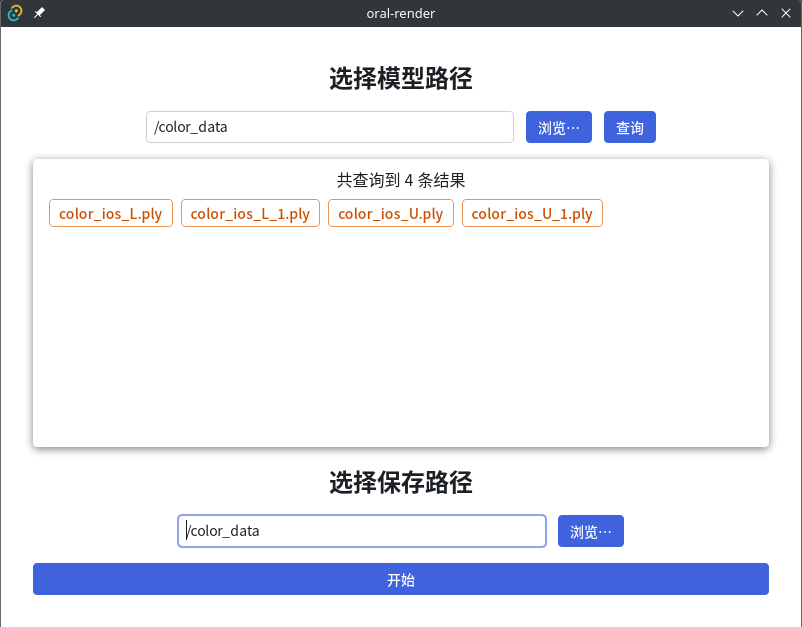
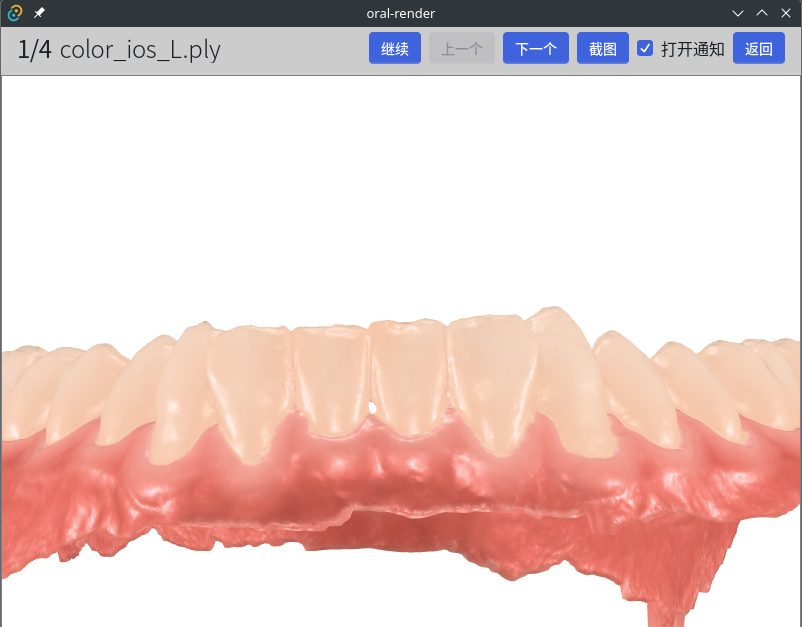

使用Next.js和Tauri构建的口扫模型渲染口内照片前端软件

## 准备

1. 安装[Rust](https://www.rust-lang.org/)和[Tauri](https://tauri.app/zh-cn/v1/guides/getting-started/prerequisites)。

2. 安装依赖：

```bash
yarn install
```

3. 启动客户端

```bash
yarn tauri dev
```

## 开始使用

### 模型生成

程序目前**仅支持PLY格式带顶点颜色的Mesh模型**，将上下颌合并为一个模型文件，并赋予顶点颜色，作为可渲染的模型。

### 路径配置

1. 在主界面中选择要渲染的模型父目录，并查询可用模型（仅支持PLY）。
2. 选择渲染图保存路径。
3. 开始。



### 开始运行

程序会对第一个模型首先进行渲染，在渲染完成后会暂停并截图。如果你对模型渲染的尺寸不满意，可以在此步骤进行视角调整，接下来的渲染过程都会使用相同的视角。调整完成后点击“截图”按钮，来覆盖初始的自动截图。

点击“继续”按钮，程序会自动渲染剩余的所有模型。在此过程中，勾选“打开通知”，程序在每次渲染完成时都会发出通知提醒。



目前渲染的图像分辨率是`1280x800`，目前没有编写调整接口。如果要修改，在`lib/slices/baseSlice.js`中修改`imageSize`变量为`[width, height]`格式即可。若非必要，不要修改该文件中的其他内容。

**注意：应用窗口和渲染画布的尺寸是独立的。因此上图中虽然窗口尺寸小于画布尺寸，导致模型没有显示完全，但生成的渲染图是完整的。你可以通过调整窗口尺寸来观察真实的画布尺寸，从而正确调整视角。**